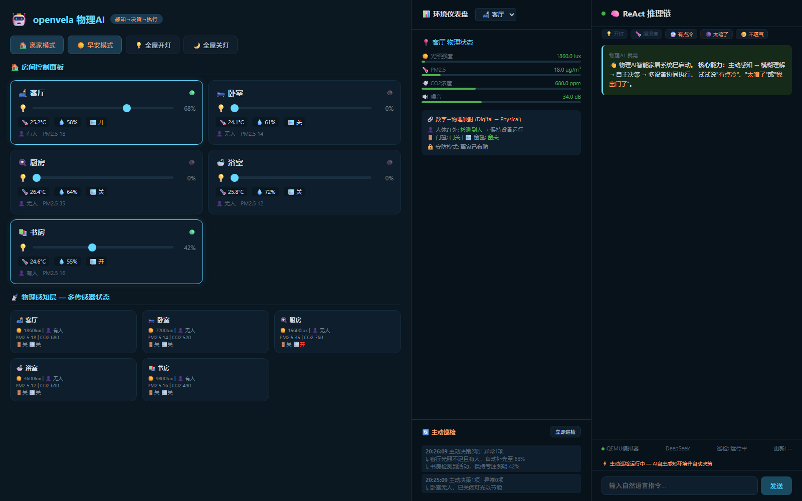
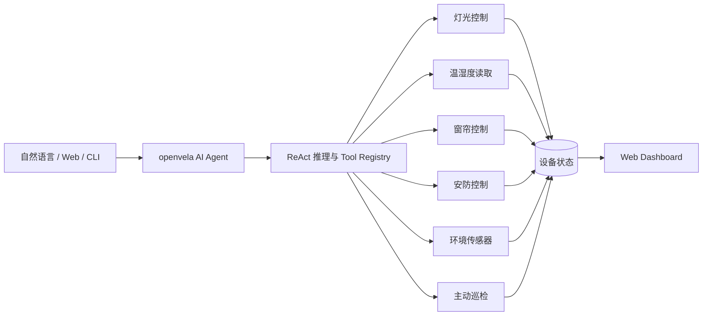

<div align="center">

# openvela Smart Home

### 面向端侧 AI Agent 的智能家居感知、决策与设备协同示例

[](https://github.com/open-vela)
[](./tools)
[](./dashboard)
[](https://github.com/yhdmcst/openvela-smart-home/actions/workflows/ci.yml)
[](./LICENSE)

自然语言交互 · ReAct 工具调用 · 多传感器感知 · 主动环境巡检 · 多设备场景联动

[快速体验](#快速体验) · [核心能力](#核心能力) · [系统架构](#系统架构) · [openvela 集成](#openvela-集成) · [项目文档](#项目文档)

</div>



## 项目简介

`openvela Smart Home` 是一个运行在 openvela / NuttX AI Agent 场景中的智能家居示例。它不只把自然语言映射成单条设备命令，还展示了完整的物理 AI 闭环：

```text
用户意图 -> 环境感知 -> Agent 决策 -> Tool 执行 -> 状态反馈 -> 持续巡检
```

项目同时提供三种体验层级：

| 路径 | 适合场景 | 依赖 |
| --- | --- | --- |
| Web Dashboard | 最快查看交互、传感器和 ReAct 推理过程 | Python 3.8+ |
| 独立 C Tool 测试 | 验证设备模型、状态持久化和安全模块 | GCC + Make + Bash |
| openvela / QEMU | 将智能家居 Tool 接入完整端侧 AI Agent | Ubuntu 22.04、openvela 工具链 |

> [!NOTE]
> Web Dashboard 使用本地模拟传感器数据，便于演示和开发；`packages/ai_agent/` 提供 openvela Agent 集成代码。接入真实设备时，只需替换各 Tool 底层的传感器与执行器实现。

## 核心能力

### 端侧工具系统

| Tool | 能力 |
| --- | --- |
| `light_control` | 灯光开关、亮度调节、全屋控制 |
| `read_temperature` | 多区域温度与湿度读取 |
| `curtain_control` | 窗帘开合与位置控制 |
| `security_control` | 在家、离家、夜间模式与门窗检查 |
| `sensor_read` | 光照、人体、门磁、PM2.5、CO2、噪声感知 |
| `environment_patrol` | 主动巡检、异常发现和节能决策 |
| `fuzzy_command` | 将“有点冷”“太暗了”等模糊表达转成结构化动作 |

### 场景编排

- **离家模式**：刷新全屋传感器、关闭灯光、关闭窗帘、检查门窗并启动安防。
- **早安模式**：读取室内外环境、调节柔光、联动窗帘并生成早安播报。
- **主动巡检**：周期感知环境，在无人时关灯、光照不足时补光、空气异常时告警。
- **上下文状态**：设备状态持久化到本地，支持“再暗一点”一类连续控制。
- **安全防护**：提供命令白名单、输入边界检查和 Tool 调用防护示例。

## 快速体验

### 1. 启动 Web Dashboard

Web 演示只依赖 Python 标准库，不需要安装第三方包。

```bash
git clone https://github.com/yhdmcst/openvela-smart-home.git
cd openvela-smart-home

python3 dashboard/bridge_server.py
```

浏览器访问 `http://localhost:8080`，可以直接尝试：

```text
打开客厅的灯
把书房灯光调到 60%
现在室温多少度
有点冷
太暗了
我出门了
```

自定义端口或巡检间隔：

```bash
python3 dashboard/bridge_server.py --port 9000 --patrol-interval 30
```

### 2. 运行本地 C 测试

在 Ubuntu、WSL 或其他具备 GCC/Make/Bash 的环境中：

```bash
make test
```

也可以运行分层测试：

```bash
./smoke_test.sh
./test_runner.sh
./test_runner.sh full
./test_runner.sh bench
```

清理测试产物：

```bash
make clean
```

## 系统架构



更完整的模块边界和数据流见 [架构说明](./docs/ARCHITECTURE.md)。

## openvela 集成

### 环境要求

- Ubuntu 22.04 LTS x86_64
- 8 GB 内存起步，推荐 16 GB
- 至少 50 GB 可用磁盘空间
- Git、Bash、CMake、GCC、QEMU 和 `repo`

### 自动构建

```bash
chmod +x auto_build_vela.sh start_simulator.sh switch_llm.sh
./auto_build_vela.sh
```

脚本会创建被 `.gitignore` 排除的 `openvela_workspace/`，下载 openvela 源码、注入智能家居 Tool，并尝试构建 `goldfish-arm64` 模拟器目标。

构建完成后启动模拟器：

```bash
./start_simulator.sh
```

### LLM 后端

```bash
./switch_llm.sh deepseek
./switch_llm.sh qwen
./switch_llm.sh ollama
```

远程后端会生成带占位符的本地配置。请仅在本地填写 API Key，切勿将密钥提交到 Git。

完整步骤、资源要求和故障排查见 [复现文档](./docs/复现文档.md)。

## 项目结构

```text
.
├── dashboard/                 # Web 控制台与本地桥接服务
├── docs/                      # 架构、复现、演示与第三方说明
├── packages/ai_agent/         # openvela AI Agent 集成层
├── security/                  # 命令白名单与安全示例
├── skills/                    # 早安、离家等场景 Skill
├── tools/                     # 可独立编译的智能家居 C Tool
├── vendor/                    # goldfish-arm64-v8a-ap 配置
├── auto_build_vela.sh         # openvela 一键构建入口
├── switch_llm.sh              # LLM 后端切换
├── test_runner.sh             # 功能、安全与性能测试
└── Makefile                   # 本地构建与测试入口
```

## 项目文档

- [系统架构](./docs/ARCHITECTURE.md)
- [完整复现指南](./docs/复现文档.md)
- [演示日志](./docs/演示日志.txt)
- [第三方依赖](./docs/THIRD_PARTY.md)
- [早安场景 Skill](./skills/good_morning_skill.md)
- [离家场景 Skill](./skills/leave_home_skill.md)

## 安全与隐私

- 仓库不包含任何真实 API Key、Wi-Fi 密码或账号凭证。
- `openvela_workspace/`、构建产物、运行状态和本地配置均已加入 `.gitignore`。
- Web Dashboard 默认监听 `0.0.0.0`，仅建议在可信开发网络中使用。
- 当前设备数据为模拟数据，不应用于真实安防或生命安全系统。

## 路线图

- [ ] 接入真实 Matter / MQTT / BLE 设备
- [ ] 增加空调与空气净化器 Tool
- [ ] 提供可复用的 openvela package 安装脚本
- [ ] 增加硬件在环测试
- [ ] 为 Dashboard 增加设备拓扑与历史趋势

## License

本项目基于 [Apache License 2.0](./LICENSE) 开源。第三方组件及其许可证见 [THIRD_PARTY.md](./docs/THIRD_PARTY.md) 与 [NOTICE](./NOTICE)。

<div align="center">
  <sub>Built for openvela AIoT exploration.</sub>
</div>
