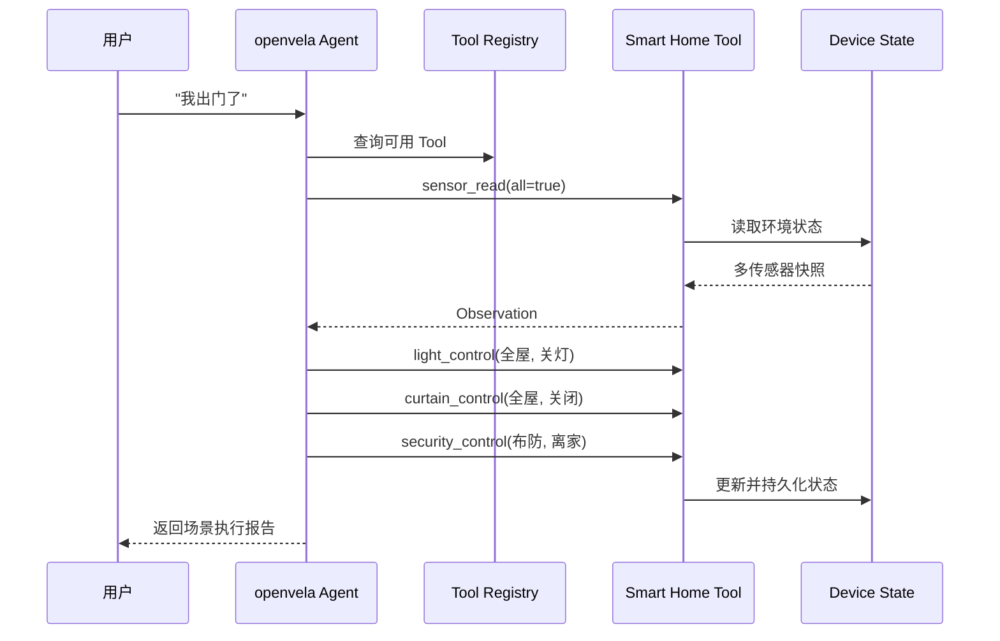

# 系统架构

## 设计目标

本项目将智能家居能力拆成可测试的 C Tool，再通过 openvela AI Agent 的 Tool Registry 暴露给 ReAct 推理循环。Web Dashboard 提供独立的本地模拟层，用于快速展示相同的“感知、决策、执行、反馈”流程。

## 分层结构

| 层 | 目录 | 职责 |
| --- | --- | --- |
| 交互层 | `dashboard/`、Agent CLI | 接收自然语言、展示状态和推理过程 |
| Agent 层 | `packages/ai_agent/src/core/` | 消息循环、会话、ReAct 推理与响应分发 |
| Tool 层 | `packages/ai_agent/src/tools/` | JSON 参数适配、Tool 注册与安全检查 |
| 设备能力层 | `tools/` | 灯光、温湿度、窗帘、安防、传感器与巡检 |
| 状态层 | `tools/device_state.c` | 设备状态管理、序列化与恢复 |
| 场景层 | `skills/` | 早安、离家等多 Tool 编排流程 |

## Agent 调用链

## 两套运行面

### Web 演示

`dashboard/bridge_server.py` 使用 Python 标准库提供 HTTP API 和本地模拟数据。它适合快速体验，不依赖 openvela 源码或 LLM 服务。

主要接口：

| Method | Path | 说明 |
| --- | --- | --- |
| `GET` | `/api/state` | 获取完整设备状态 |
| `POST` | `/api/command` | 执行自然语言指令 |
| `GET` | `/api/patrol/log` | 获取主动巡检日志 |
| `GET` | `/api/patrol/trigger` | 手动触发巡检 |
| `POST` | `/api/light` | 直接更新灯光状态 |

### openvela Agent

`packages/ai_agent/` 包含 Agent 主流程、工具注册以及智能家居适配层。`tool_smart_home.c` 将 JSON Schema 和 Tool 执行函数注册到现有工具系统，底层实现复用根目录 `tools/` 中的 C 源码。

## 扩展真实硬件

接入真实设备时，建议保持 Tool 接口不变，仅替换设备能力层：

1. 在 `tools/` 中将模拟状态读写替换为 Matter、MQTT、BLE、GPIO 或厂商 SDK。
2. 保持 `smart_home_tools.h` 中的参数和结果结构稳定。
3. 为真实设备错误增加明确的超时、离线和权限返回码。
4. 在 `test_runner.sh` 中加入硬件在环测试或 mock transport。
5. 对安防、门锁等敏感操作增加二次确认和审计记录。
